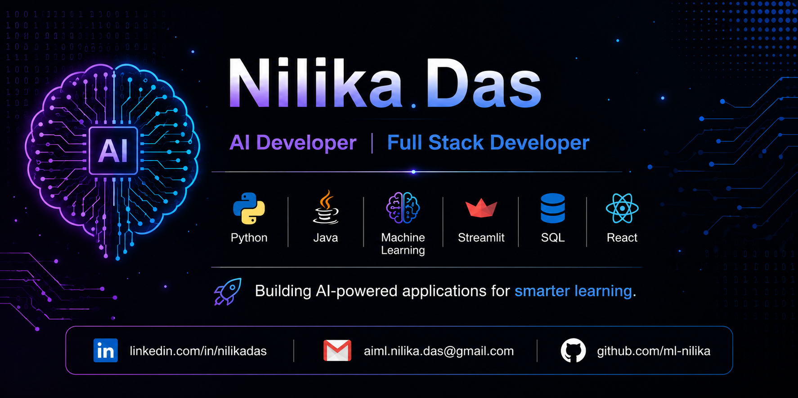

  

<h1 align="center">Hi 👋, I'm Nilika Das</h1>

  

---

## 🚀 About Me

- 🎓 Final Year Computer Science Engineering Student
- 🤖 Passionate about Artificial Intelligence, Machine Learning and Full Stack Development.
- 💻 Skilled in Python, Java, SQL and modern web technologies.
- 🌱 Currently learning React, Backend Development and System Design.
- ⚡ I enjoy building real-world software that solves practical problems.

---

## 🛠 Tech Stack

---

## 🚀 Featured Projects

### 😀 Face Emotion Recognition
A real-time facial emotion recognition system using CNN and OpenCV that detects facial expressions such as happy, sad and angry using webcam input.

---

### 📰 Fake News Detection
A Machine Learning project that classifies news articles as Fake or Real using Natural Language Processing and TF-IDF Vectorization.

---

### 🎯 Fit4Interview
An AI-powered interview evaluation platform that provides technical interview assessment using Python and NLP.

---

### 💼 Employee SQL Project
A complete SQL-based Employee Management System demonstrating joins, CTEs, window functions, indexes, stored procedures and views.

---

## 📊 GitHub Stats

---

## 🔥 GitHub Streak

---

## 📈 Contribution Graph

---

## 👀 Visitor Counter

---

## 🌐 Connect With Me

&nbsp;&nbsp;

&nbsp;&nbsp;

---

<h3 align="center">
⭐ Thanks for visiting my profile! ⭐
</h3>
